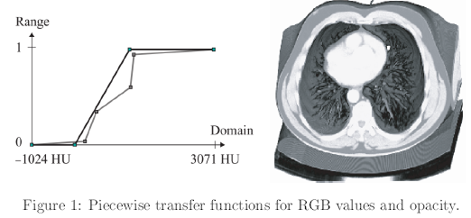
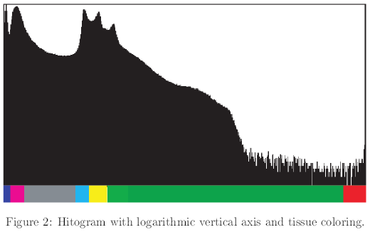
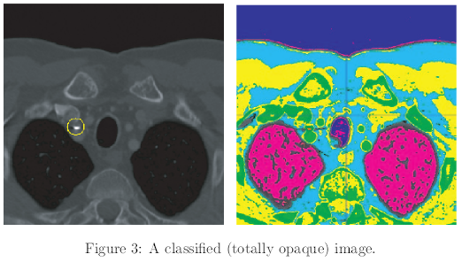
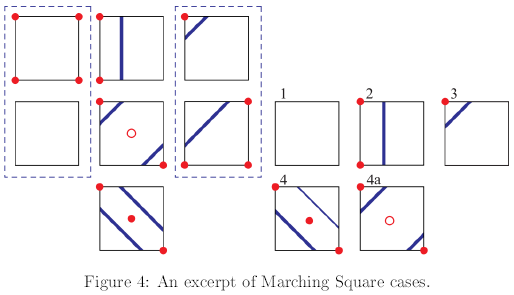

# Questions 3

> Francisco Javier Bolívar Lupiáñez

## Issues about Fundamentals of Volume Visualization

**1.- The classification step in the volume visualization pipeline determines how each voxel contributes to the final image by means of transfer functions. Define the aim of a transfer function and list the four transfer functions commonly used in volume visualization.**

Respuesta

**2.- Describe an example of how histograms can be useful in the classification step and propose a procedure and an interface that permits the interactive specification of this step. Look at the images below (Figs. 1, 2 and 3).**

Respuesta

**3.- Write a pseudocode for calculating Phong Illumination Model for each voxel of a volume dataset taking into account that the classification step has been finished - you hace color per voxel! Don't consider the opacity assigned.**

Respuesta

## Issues about Indirect Volume Visualization

**1.- Describe the isosurface specification model commonly used in polygonal isosurface extraction.**

Respuesta

**2.- Draw the 16 possible cases produced by Marching Squares algorithm indicating the equivalence classes that rotations and complement (inversion) produce. See the Fig. 4 for a guidance.**

Respuesta

**3.- Write a pseudocode for extracting an isosurface using a marching cubes from a volume dataset. The isovalue tau and the dataset will be specified as a parameter. You must approximate the normals using the central difference operator and suppose the classification step is preiously done - you have colors and opacities in each voxel together with the true density value. The output will be the triangle mesh with color and opacity per vertex. You have not to write low-level code, just use functions (methods), named clearly, for each different porcessing.**

Respuesta

## Issues about Direct Volume Visualization (Rendering)

**1.- Describe the main idea which direct volume rendering relies on. Base your explanation in the discretized volume rendering equation.**

Respuesta

**2.- Explain why compositing can be done in two directions and explain *back to front compositing*.**

Respuesta