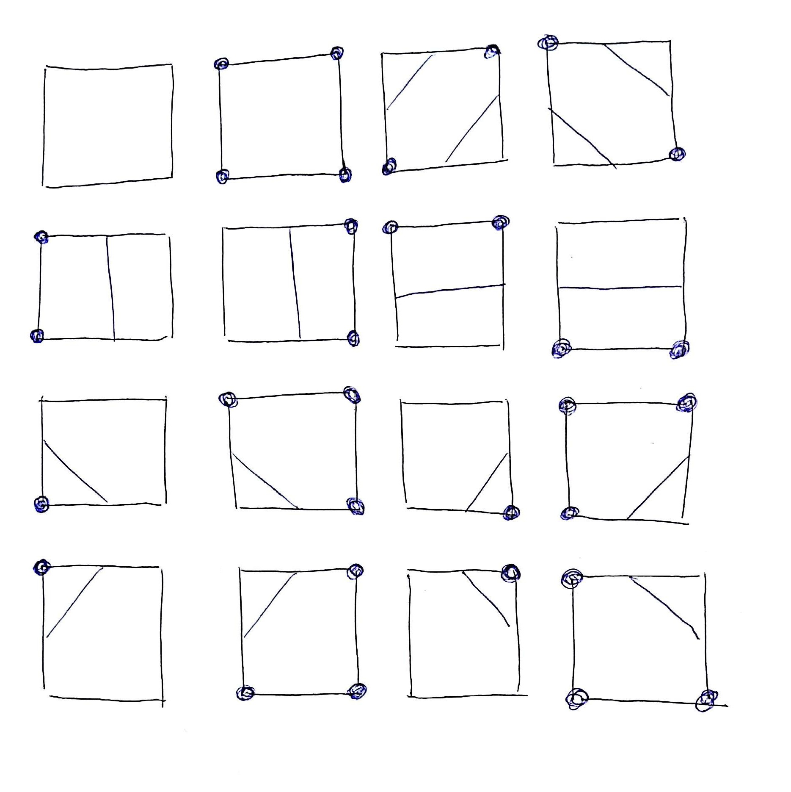

# Questions 3

> Francisco Javier Bolívar Lupiáñez

## Issues about Fundamentals of Volume Visualization

**1.- The classification step in the volume visualization pipeline determines how each voxel contributes to the final image by means of transfer functions. Define the aim of a transfer function and list the four transfer functions commonly used in volume visualization.**

La función de transferencia mapea valores escalares de vóxeles a propiedades ópticas. Las cuatro funciones de transferencia serían las de los tres canales de color (RGB) y la de opacidad.

**2.- Describe an example of how histograms can be useful in the classification step and propose a procedure and an interface that permits the interactive specification of this step. Look at the images below (Figs. 1, 2 and 3).**


Los histogramas nos sirven para detectar los distintos materiales que se encuentran en una imagen. Cada uno de los picos puede corresponder a un material. El problema es que no todo es tan bonito ya que hay materiales cuyo rango de valores pueden solaparse. Por ejemplo: la sangre tiene valores de 30 a 45 HU y el músculo de 10 a 40 HU. No obstante, el histograma sigue siendo útil pues nos da pistas para definir las distintas partes de función de transferencia (color y opacidad).

Para especificar la función de transferencia se le podría proveer al usuario de una gráfica interactiva (la que forma tanto la función de transferencia de color como de opacidad) con la función de transferencia mostrándose de fondo. Para la parte de color se podría mostrar, en lugar de la curva de la función para cada uno de los valores RGB el color del que se pintaría. Algo así como lo que aparece en la Figura 2. El usuario podría pinchar en la curva de la función para añadir puntos de control o editar los ya existentes. Mostrándose el efecto de los cambios al instante.

**3.- Write a pseudocode for calculating Phong Illumination Model for each voxel of a volume dataset taking into account that the classification step has been finished - you have color per voxel! Don't consider the opacity assigned.**

```java
ColorRGB phong(Voxel voxel, Light[] lights, View view):
  voxel.setNormal(centralDifferences(voxel));
  ColorRGB iAmb = kAmb * cAmb * voxel.getDiffColor();
  ColorRGB sum = new ColorRGB();
  for (Light light: lights) {
    ColorRGB iDiff = kDiff * light.getColor() * voxel.getDiffColor() * 
             dotProduct(voxel.getNormal(), light.getDirection());
    Vector perfectReflector = mirror(voxel.getNormal(), light.getDirection());
    ColorRGB iSpec = kSpec * light.getColor() * voxel.getSpecColor() * 
             pow(dotProduct(perfectReflector, view.getPosition()), m);
    sum += iDiff + iSpec;
  }
  return iAmb + cAtt * sum;
```

## Issues about Indirect Volume Visualization

**1.- Describe the isosurface specification model commonly used in polygonal isosurface extraction.**

Una isosuperficie se especifica con una superficie implícita en al que la diferencia de la función implícita y el isovalor es 0:

```
i(x) = V(x) - tau
```

Donde `x` es la posición del voxel y `tau` es el isovalor.

Con esta fórmula se podría diferir entre voxeles que están dentro o fuera de la superficie:

- Si `i(x) < 0`: está fuera
- Si `i(x) > 0`: está dentro
- Si `i(x) = 0`: forma parte de la isosuperficie

**2.- Draw the 16 possible cases produced by Marching Squares algorithm indicating the equivalence classes that rotations and complement (inversion) produce. See the Fig. 4 for a guidance.**




**3.- Write a pseudocode for extracting an isosurface using a marching cubes from a volume dataset. The isovalue tau and the dataset will be specified as a parameter. You must approximate the normals using the central difference operator and suppose the classification step is previously done - you have colors and opacities in each voxel together with the true density value. The output will be the triangle mesh with color and opacity per vertex. You have not to write low-level code, just use functions (methods), named clearly, for each different processing.**

```java
Mesh isosurface(Volume data, int isovalue) {
  Mesh output;
  for (int i = 1; i < data.size().x() - 2; i++) {
    for (int j = 1; j < data.size().y() - 2; j++) {
      for (int k = 1; k < data.size().z() - 2; k++) {
        int[] values = new int[8];
        data.getDensity(i - 1, j - 1, z - 1) - isovalue >= 0 ? values[0] = 1 : values[0] = 0;
        data.getDensity(i - 1, j + 1, z - 1) - isovalue >= 0 ? values[1] = 1 : values[1] = 0;
        data.getDensity(i + 1, j - 1, z - 1) - isovalue >= 0 ? values[2] = 1 : values[2] = 0;
        data.getDensity(i + 1, j + 1, z - 1) - isovalue >= 0 ? values[3] = 1 : values[3] = 0;
        data.getDensity(i - 1, j - 1, z + 1) - isovalue >= 0 ? values[4] = 1 : values[4] = 0;
        data.getDensity(i - 1, j + 1, z + 1) - isovalue >= 0 ? values[5] = 1 : values[5] = 0;
        data.getDensity(i + 1, j - 1, z + 1) - isovalue >= 0 ? values[6] = 1 : values[6] = 0;
        data.getDensity(i + 1, j + 1, z + 1) - isovalue >= 0 ? values[7] = 1 : values[7] = 0;
        output.addTriangles(getMarchingCubesTrianglesFromTable(values));
      }
    }
  }
  return output;
}
```

## Issues about Direct Volume Visualization (Rendering)

**1.- Describe the main idea which direct volume rendering relies on. Base your explanation in the discretized volume rendering equation.**

En el caso de *ray-casting* se lanza un rayo por cada píxel que atraviesa la escena y va acumulando los valores de opacidad y color de los vóxeles con los que incide obteniendo un color final que será el que se utilizará para colorear ese píxel.

**2.- Explain why compositing can be done in two directions and explain *back to front compositing*.**

La composición se basa en el operador over que es asociativo, lo que significa que el orden de las evaluaciones puede cambiarse obteniendo el mismo resultado, por eso se puede realizar en ambas direcciones.

El *back to front* se realiza desde el final del volumen hasta el píxel desde donde se lanza en rayo, (en dirección hacia el punto de vista). El valor para la posición `k` se calcula como el valor previo multiplicado por la transparencia más el color en el punto `k`. El valor inicial será el color ambiente de la luz de fondo:

```
I_k = I_{k-1} * t_k + C_k,  k = 1, ... , n-1
I_0 = ambient background light
```