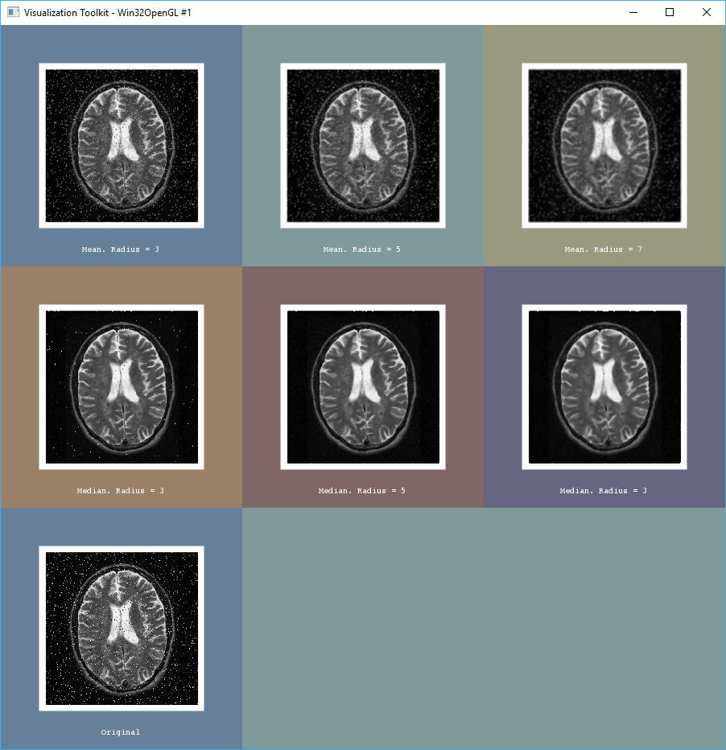
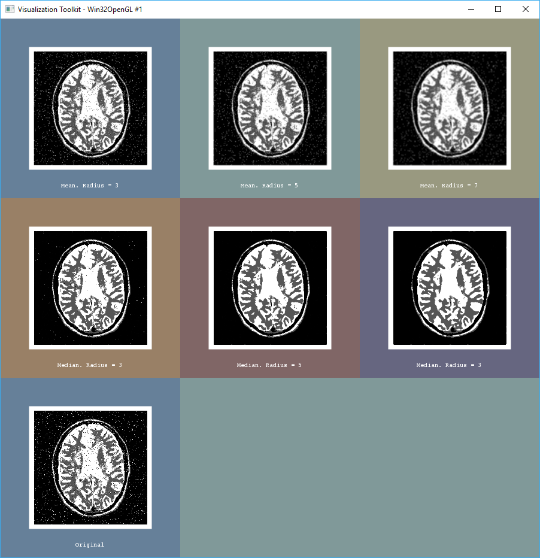
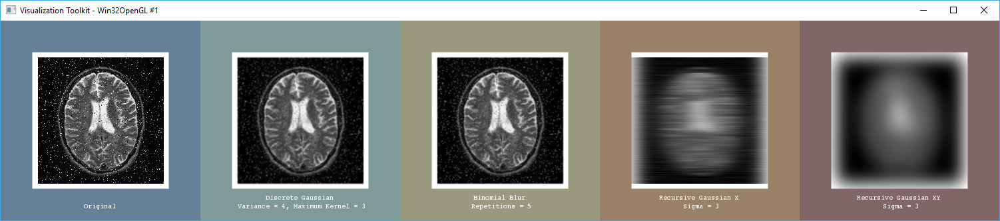
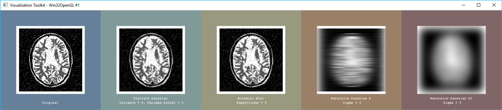
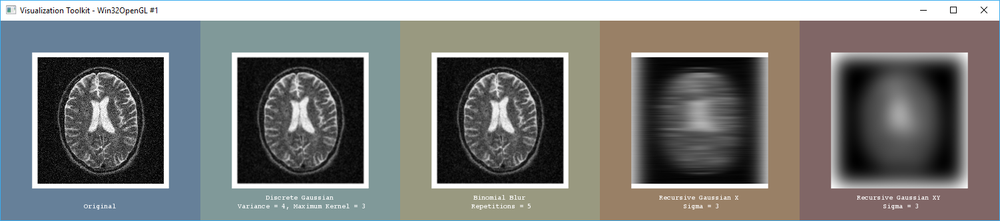
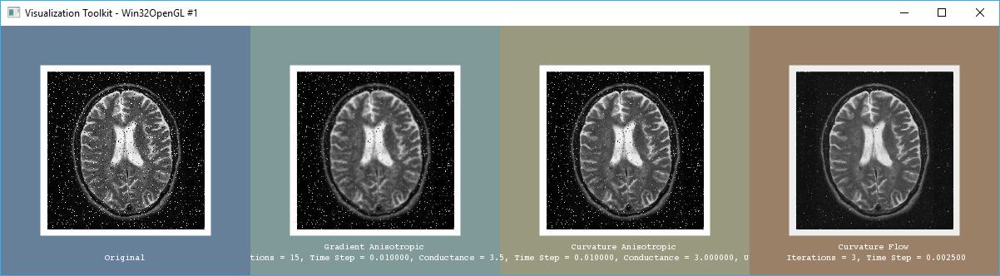
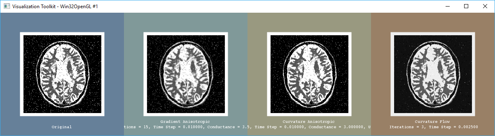
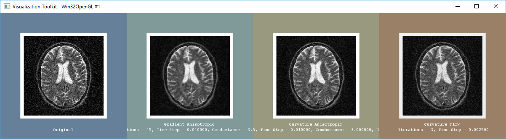

# Script 3: Filtrado (I)

> Francisco Javier Bolívar Lupiáñez

## Mean and Median

#### Salt and Pepper Noise 1

#### Salt and Pepper Noise 2

#### Gaussian Noise

### Conclusiones

Vemos como el median filter es el que mejor se comporta a la hora de quitar ruido del tipo salt and pepper (con una neighbourhood de 5x5 lo borra casi en su totalidad), no obstante no funciona demasiado bien con el ruido gaussiano y puede juntar bordes.

## Smoothing Filters

#### Salt and Pepper Noise 1

#### Salt and Pepper Noise 2

#### Gaussian Noise

### Conclusiones

Los filtros smoothing, al contrario que el median filter, no se comportan bien con el ruido del tipo salt and pepper pero sí con el gaussiano. Los valores que se le tienen que dar han de ser muy específicos para cada imagen pues cambian su efecto enormemente de una otra. Por ejemplo se puede ver como los dos últimos filtros de recursive gaussian, con una sigma alta puede estropear bastante la imagen.

## Edge Preserving Smoothing

#### Salt and Pepper Noise 1

#### Salt and Pepper Noise 2

#### Gaussian Noise

### Conclusiones

Los filtros edge preserving, al igual que los smoothing, no se comportan bien con el ruido del tipo salt and pepper pero sí con el gaussiano, donde además, al ser adaptativo, tiene en cuenta los bordes a la hora de filtrar.