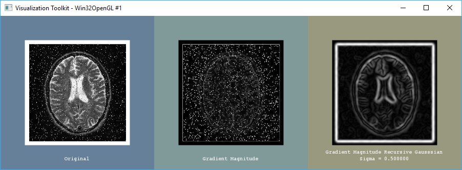
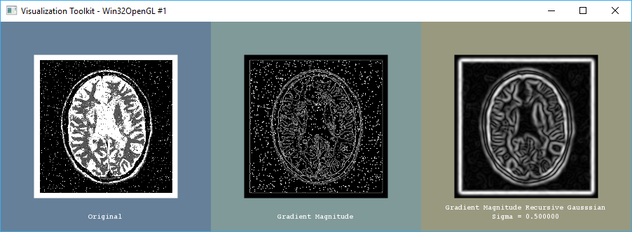
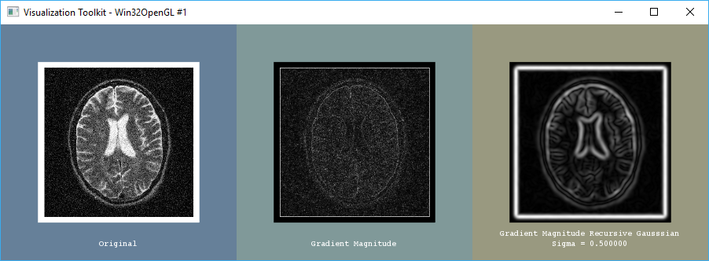
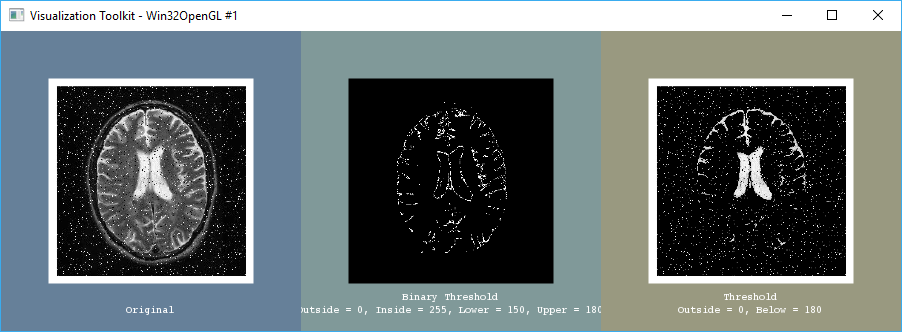
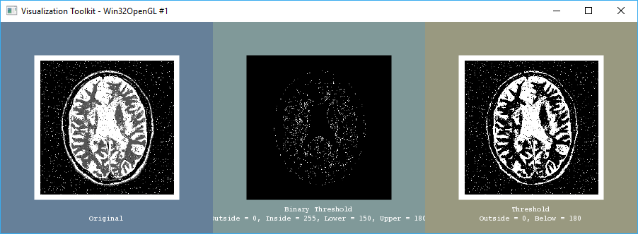
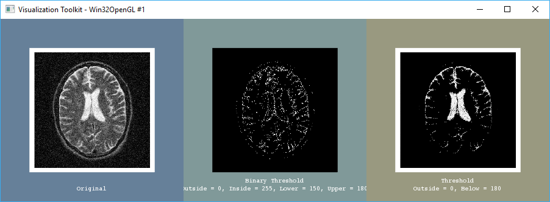
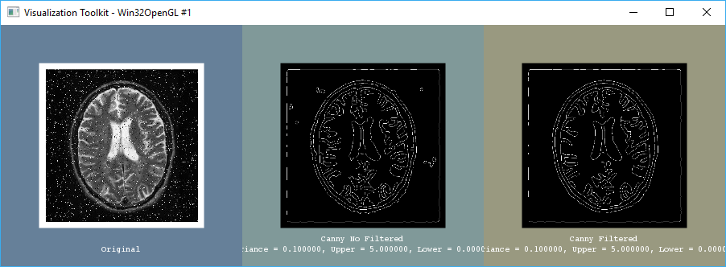
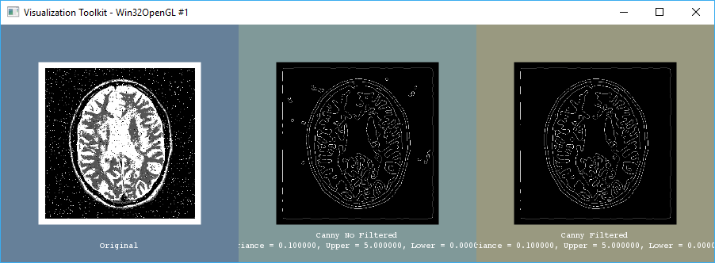
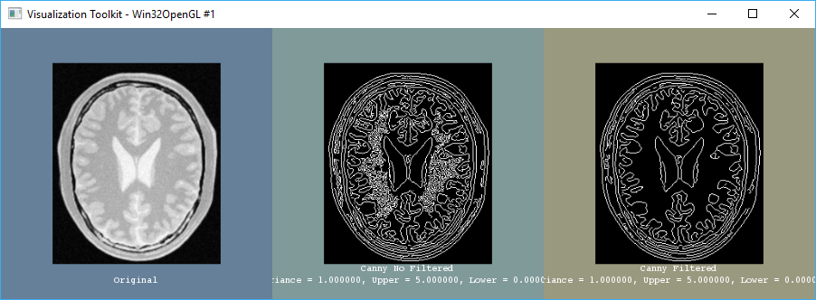

# Script 4: Filtrado (II)

> Francisco Javier Bolívar Lupiáñez

## Gradient Computation

#### Salt and Pepper Noise 1

#### Salt and Pepper Noise 2

#### Gaussian Noise

### Conclusiones

Vemos como aplicar la detección de gradientes en imágenes con ruido sin filtrar puede dar resultados malos que se pueden salvar un poco usando un cómputo gaussiano recursivo. No obstante, es mucho más adecuado aplicar un filtro de los vistos en el [tema anterior](script3).

## Thresholding

#### Salt and Pepper Noise 1

#### Salt and Pepper Noise 2

#### Gaussian Noise

### Conclusiones

El thresholding es una aproximación burda a la segmentación, en este caso vemos dos orientaciones o binario con un valor mínimo y máximo o basíco con un valor de iso-superficie a partir del cual considerar. También observamos como sería necesario aplicar algún filtro antes de realizar esta primera segmentación.

## Edge Detection

#### Salt and Pepper Noise 1

#### Salt and Pepper Noise 2

#### Gaussian Noise

#### Brain Proton Slice (sin ruido)

### Conclusiones

Al igual que los filtros anteriores, se ve que es necesario filtrar antes. A la derecha se observan los bordes detectados sobre una imagen previamente filtrada con un median filter y a la izquierda sin este. Se ve como afecta en las imágenes con ruido de tipo salt and pepper e incluso en la última de las imágnes donde no hay ruido. También se puede ver la importancia de los parámetros. En la imagen sin rudio con una varianza de 1 ha bastado para tener un buen resultado, pero en las imágenes con ruido ha hecho falta bajar hasta diez veces este valor.