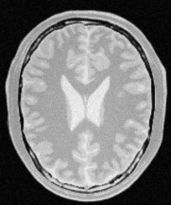
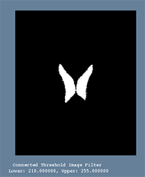
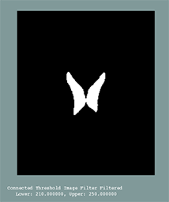
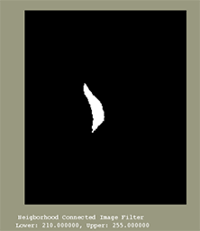
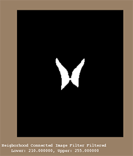
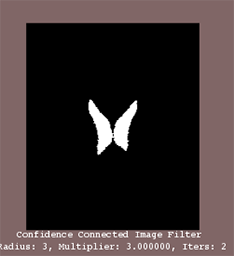
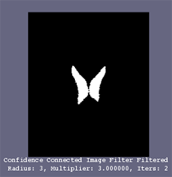
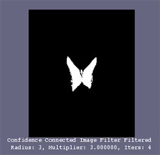

# Script 5: Segmentación

> Francisco Javier Bolívar Lupiáñez

## Cerebro

Usando el archivo `BrainProtonDensitySlice256x256.png`:

Se ha segmentado tanto el plexo coroideo como la sustancia blanca.

### Plexos coroideos

Al ser una imagen bastante buena, apenas se nota la diferencia entre aplicarle o no un filtrado, no obstante, se le ha aplicado un *median filter* para suavizarla.

#### *Connected Threshold*

* Seed: 91, 118 
* Threshold: 210, 255

##### Sin filtro

##### Con filtro

#### *Neighbourhood Connected*

* Seed: 91, 118 
* Threshold: 210, 255

##### Sin filtro

En este caso, el no agregar el filtrado previo hace que la segmentación no se haga completa y segmente solo una parte del plexo.

##### Con filtro

#### *Confidence Connected*

* Seed: 91, 118 
* Radius: 3
* Multiplier: 3
* Iters: 2 (a partir de la tercera iteración empieza a segmentar zonas que no forman parte del plexo coroideo)

##### Sin filtro

##### Con filtro

##### 4 iteraciones

### Sustancia blanca